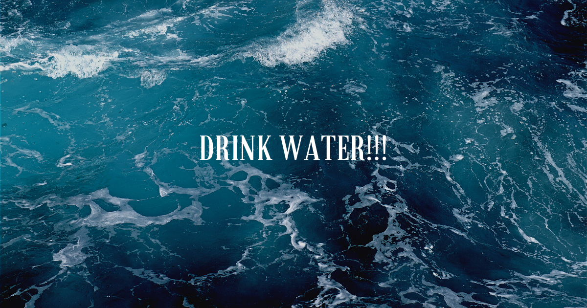

# Aplikacja nawadniająca

Apka która pomoże w odpowiednim nawodnieniu organizmu

## Chronologia

1. Stworzenie projektu za pomocą programu Figma
2. Utworzenie nowego projetku
3. Przeniesienie grafiki za na jezyk HTML
4. Popranie wszystkich elementów i przypisanie im odpowiednich funkcji.
5. Wykorzystanie pamięci lokalnej do dziennego zapisu ilości.
6. Rozszerzenie programu o akywności fizyczne zmieniające zapotrzebowanie na wodę
7. Wprowadzenie animacji pojawiającej się po przkroczeniu dziennego zapotrzebowania
8. Niespodzianka dla ludzi zainteresowanych ile należy wypić wody intensywnie "kodując"
9. Aktualicacja sekcji head i utworzenie grafiki w podglądzie aplikacji.

## Kolejne etapy

1. Zwiększanie ilości zapisanych informacji i wykorzystanie ich do optymalizacji aplikacji.
2. Kodowanie...
